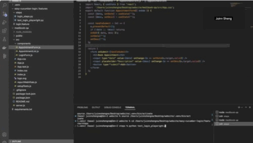
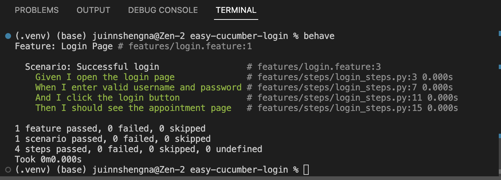
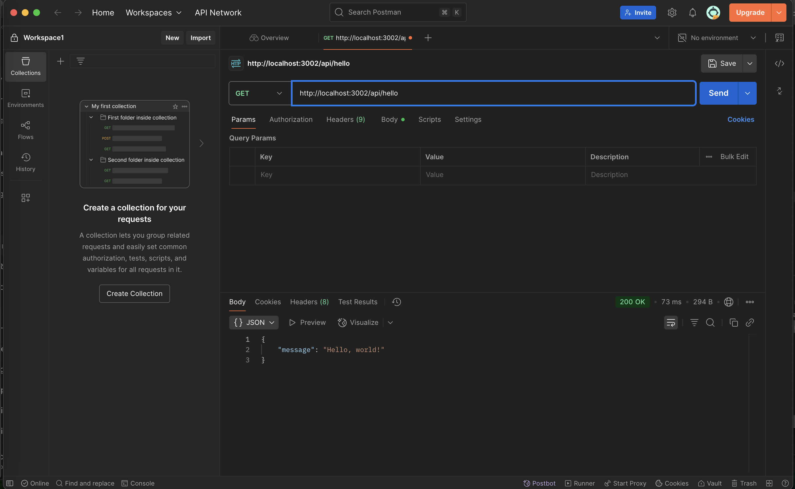

# 🩺 MediBook QA Testing Portfolio Project

Welcome to **MediBook QA**, a beginner-friendly **QA portfolio project** built to showcase core skills in:

- ✅ Manual API Testing (Postman)
- ✅ UI Automation Testing (Playwright with Python)
- ✅ Behavior-Driven Development (Behave + Gherkin)
- ✅ Test Planning & Bug Reporting
- ✅ React Web App Testing

---

## 🎥 Demo Highlights

### ✅ Automated UI Testing with Playwright

### ✅ BDD Testing with Behave

### ✅ Manual API Testing with Postman

---
---

## 🧪 Testing Types Covered

| Test Type      | Tool/Tech         | Description |
|----------------|-------------------|-------------|
| Manual API     | Postman           | Test login and appointment endpoints |
| UI Automation  | Playwright (Python)| Automate login workflow and UI checks |
| BDD            | Behave + Gherkin  | Write readable tests for login flow |
| Frontend       | React             | Target for testing (basic login + booking app) |

---

